# Мастер-класс: Создание Telegram-бота для декомпиляции файлов 1С на OneScript и Осени

## Содержание

1. [Введение](#введение)
2. [Почему Осень?](#почему-осень)
3. [Техническое задание](#техническое-задание)
4. [Архитектура](#архитектура)
5. [Создание структуры проекта](#создание-структуры-проекта)
6. [Добавляем бота](#добавляем-бота)
7. [Предварительные итоги](#предварительные-итоги)
8. [Работаем с секретами](#работаем-с-секретами)
9. [Добавляем логирование](#добавляем-логирование)
10. [Работа с интерфейсом](#работа-с-интерфейсом)
11. [Разбор бинарников](#разбор-бинарников)
12. [Публикация файлов](#публикация-файлов)
13. [Подключаем базу данных](#подключаем-базу-данных)
14. [Подключаем базу данных](#асинхронное-выполнение)
15. [Итоги и домашнее задание](#итоги-и-домашнее-задание)


## Введение

Приветствую всех! Меня зовут Чегодаев Павел, и я хочу вместе с вами пройти мастер-класс по разработке бота на OneScript и фреймворке Осень.

На написание этой статьи меня вдохновила публикация [От базовой библиотеки до полного расцвета с ОСенью. Разработка базовой версии](https://infostart.ru/1c/articles/2275659/). Поскольку вторая часть пока не вышла, я возьму на себя смелость продолжить начинания Владимира.

## Почему Осень?
Есть желание расширять кругозор после 15 лет работы с 1С. В Осени многие концепции заимствованы из [Java](https://infostart.ru/1c/articles/1980026/) — это стало отличным поводом изучить новые подходы, оставаясь в знакомой среде языка 1С.

Поскольку статья про мониторинг, возможно, когда-нибудь выйдет, я предлагаю взять другую тему.

## Техническое задание

Цель: Мобильно получать код из исходников на телефон.
Описание:
Создать Telegram-бота, который на вход принимает бинарные файлы, а на выходе возвращает исходный код.
Приложение должно разворачиваться в контейнере Docker.

Чтение кода должно быть реализовано максимально удобно.

## Архитектура
Любая разработка начинается с архитектуры решения. Давайте определим основную функциональность, которая должна быть реализована:

+ Обработка сообщений в боте
+ Разбор файлов на исходники
+ Публикация исходников

Попробуйте самостоятельно нарисовать диаграмму классов, а затем мы сравним результаты.

Как мы все знаем, в прошлом писался код с «километровыми» методами, которые выполняли множество задач одновременно. Мы не будем следовать такому подходу. Паттернов и подходов к разработке приложений много, но давайте возьмем за основу **MVC**.

Попробуем разделить наше приложение на слои, чтобы они были независимы.

**Что такое MVC:**
- **M (Model)** — здесь работа с БД и бизнес-логика.
- **V (View)** — так как у нас Telegram-бот, то за представление пусть он и отвечает.
- **C (Controller)** — это наш мостик между представлением и бизнес-логикой.

У меня получилось так:


Для удобства я буду диаграммы также оставлять в исходном виде

<details>
<summary>Диаграмма классов</summary>

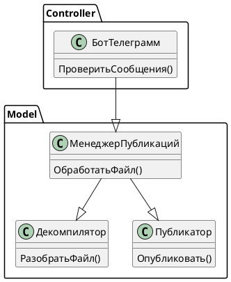
</details>

Давайте создадим структуру проекта. Что бы я ни делал, я всегда начинаю с команды git init — это позволит впоследствии версионировать код и, возможно, поделиться им с вами. :)

Любое приложение на Осени начинается с точки входа. Создадим файл `main.os` и другие файлы согласно нашей диаграмме.

### Создание структуры проекта

Ожидаемая структура:

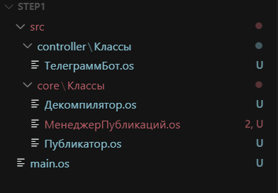

<details>
<summary>main.os</summary>

```bsl
// main.os

#Использовать "./src/core"
#Использовать "./src/controller"
#Использовать autumn

Поделка = Новый Поделка();
Поделка.ЗапуститьПриложение();
```
</details>

Здесь мы сразу подключаем папки `/src/controller` и `/src/core` к нашему приложению, а также фреймворк Осень, который впоследствии значительно упростит разработку.

Но что произойдет в момент вызова `ЗапуститьПриложение()`? Как сделать, чтобы наш бот заработал?

Мы должны создать класс, у которого будет аннотация `&Рогатка`, и метод `ПриЗапускеПриложения()`. Давайте добавим такой класс к нашему проекту.

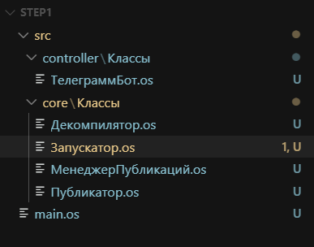

<details>
<summary>src\core\Классы\Запускатор.os</summary>

```bsl
// src\core\Классы\Запускатор.os

#Область ОбъявлениеПеременных

&Пластилин("ТелеграммБот") 
Перем ТелеграммБот; // Класс для запуска Telegram-бота

#КонецОбласти

#Область ПубличныйИнтерфейс

&Рогатка
Процедура ПриСозданииОбъекта()
КонецПроцедуры

Процедура ПриЗапускеПриложения() Экспорт

	КоличествоПопытокЗапуска = 10;
	Для Счетчик = 1 По КоличествоПопытокЗапуска Цикл
		
		Попытка
			Сообщить("Старт");
			ТелеграммБот.Запустить();
		Исключение
			Сообщить(ПодробноеПредставлениеОшибки(ИнформацияОбОшибке()));
		КонецПопытки;	
	КонецЦикла;
	Сообщить("Не удалось запустить бот");

КонецПроцедуры

#КонецОбласти
```
</details>

Теперь разберем код выше. У нас есть класс, который реализует логику общения с Telegram, мы его назвали `ТелеграммБот`. Чтобы начать работать с этим классом, у нас есть два пути:

1) Создать экземпляр в коде:

```bsl
ТелеграммБот = Новый ТелеграммБот;
ТелеграммБот.Запустить()
```

2) Внедрить через механизм внедрения зависимостей Осени, причем внедрять можно тремя способами:

Через свойства, как в варианте выше:
```bsl
&Пластилин("ТелеграммБот") 
Перем ТелеграммБот; // Класс для запуска Telegram-бота
```

Через специальный метод-сеттер:
```bsl
Перем ТелеграммБот;

&Пластилин
Процедура УстановитьТелеграммБот(Значение) Экспорт
    ТелеграммБот = Значение;
КонецПроцедуры
```
или через [конструктор](https://autumn-library.github.io/framework-elements/components-binding)

В каких случаях это может быть полезно?
Например, у нашего класса `ТелеграммБот` есть поле `Токен` и разные методы `ОтправитьСообщение()`, `ОтправитьКартинку()` и т. д.

В одном месте мы заполняем токен, потом в любых других местах через аннотацию `&Пластилин` мы получаем экземпляр этого класса, а он уже настроен так, как нам нужно, то есть у него уже заполнено поле токен.


## Добавляем бота

Нам нужно как-то взаимодействовать с ботом. Варианта два: либо писать самому, либо использовать существующие библиотеки.

Хороший программист стремится использовать готовые решения — давайте использовать готовую библиотеку. Мне нравится библиотека Антона [ОПИ](https://openintegrations.dev/), поражает подход к написанию и развитию этой библиотеки. Внимание ко всем мелочам.

<details>
<summary>src\controller\Классы\ТелеграммБот.os</summary>

```bsl
// src\controller\Классы\ТелеграммБот.os

#Использовать oint 

#Область ОбъявлениеПеременных

Перем Смещение;

Перем Токен;

#КонецОбласти

#Область ПубличныйИнтерфейс

&Желудь
Процедура ПриСозданииОбъекта()
	
КонецПроцедуры

Процедура Запустить() Экспорт

	Сообщить("Запущен");
	Токен = "7967956539";

	Пока Истина Цикл
		
		Ответ = OPI_Telegram.ПолучитьОбновления(Токен, 30, Смещение);
		Результат = Ответ["result"];
		
		Если Результат = Неопределено ИЛИ Результат.ВГраница() = -1 Тогда
			Продолжить;
		Иначе
			Сообщение = Результат[Результат.ВГраница()];
			Смещение = Сообщение["update_id"] + 1;
		КонецЕсли;

		ОбработатьСообщение(Сообщение);
	КонецЦикла;
	
КонецПроцедуры

#КонецОбласти

#Область СлужебныеПроцедурыИФункции

Процедура ОбработатьСообщение(Сообщение)

	ЧатИД = Сообщение["message"]["chat"]["id"];

	OPI_Telegram.ОтправитьТекстовоеСообщение(Токен, ЧатИД, Сообщение["message"]["text"]);	
КонецПроцедуры

#КонецОбласти
```
</details>

Теперь разберем, что тут написано.
 
Мы подключили `oint` (ОПИ), чтобы использовать уже готовые интеграции с Telegram.
А еще мы подошли к тому, чтобы обсудить более детально Осень.
У метода `ПриСозданииОбъекта()` установили аннотацию `&Желудь` — так мы указали, что этот класс мы можем получить в любой момент из Контейнера, создаваемого Осенью, например, как мы сделали в классе Запускатор.

Когда мы пишем `&Пластилин`, мы получаем экземпляр нашего объекта.
Как можно более простым языком это описать? Если очень грубо, то давайте представим, что у нас есть глобальный контекст и есть глобальная переменная `Соответствие`.
Ключ — имя класса, значение — сам объект. В любом месте мы можем получить его и использовать.


## Предварительные итоги

На этом этапе у нас с вами готова основа, наш бот даже сейчас будет отвечать эхом. Можно запустить отладку. Для удобства пропишем в отладку запускаемый файл — тогда, независимо от позиционированного в проекте файла, все равно запустится нужный.


Проверяем наш бот — работает! УРА!

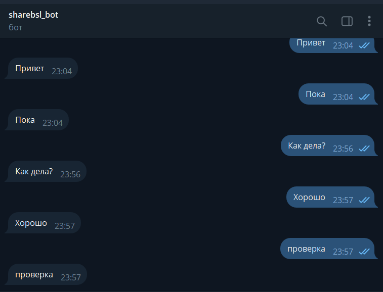


## Работаем с секретами

Внимательный читатель наверняка заметил, что очень нехорошо писать токен в коде, особенно когда потом проект идет в публичный репозиторий GitHub. Существуют даже роботы, которые сканируют GitHub на предмет различных секретов.
Мы могли бы создать конфигурационный файл с настройками, запрограммировать его чтение, но Осень все сделала за нас.

Нам всего-то нужно создать файл `autumn-properties.json` и указать все секреты там. Не забывайте указывать его в `.gitignore`, иначе секреты в итоге все равно попадут в публичный доступ.

Попробуем создать конфигурационный файл:

Добавили `autumn-properties.json`.


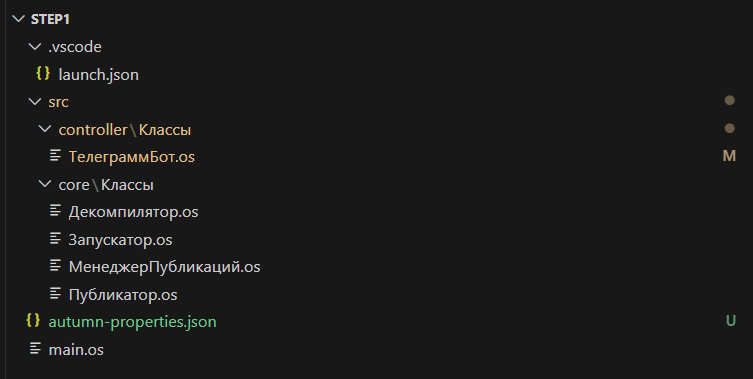

```json
{
    "TELEGRAMM": {
        "TOKEN": "7967956539:"
  
    }
}
```

Теперь, чтобы получить доступ к нашей «Настройке», нам нужно воспользоваться аннотацией `&Деталька`.
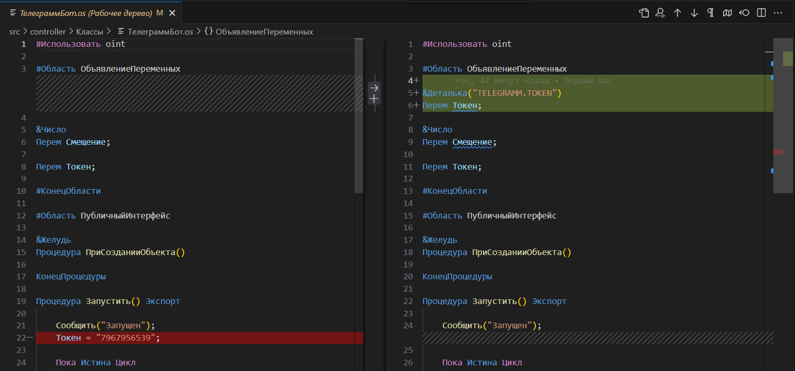

## Добавляем логирование

Как и в первой части, нам пора позаботиться о логировании нашего приложения. Вместо того чтобы везде писать `Сообщить()`, давайте используем более продвинутую систему логирования.

### Создание класса ЛогАннотация

Добавим библиотеку работы с логами `#Использовать autumn-logos`, прочитать про нее подробнее можно [тут](https://github.com/autumn-library/autumn-logos).

<details>
<summary>Доработали main.os</summary>

```bsl
// main.os

#Использовать "./src/core"
#Использовать "./src/controller"
#Использовать autumn
#Использовать autumn-logos // Добавили библиотеку работы с логами
```
</details>

Для удобства работы с логами создадим специальный класс `ЛогАннотация.os` в папке `src/core/Классы/`. Благодаря функциональности [Собственные аннотации](https://autumn-library.github.io/framework-elements/custom-annotations) это возможно.

<details>
<summary>src/core/Классы/ЛогАннотация.os</summary>

```bsl
// src/core/Классы/ЛогАннотация.os

&Аннотация("ЛогПубликация")
&Лог("oscript.lib.share_bsl")
Процедура ПриСозданииОбъекта()

КонецПроцедуры
```
</details>

Теперь для подключения лога достаточно в классе добавить `&ЛогПубликация Перем Лог;`.
Попробуем переписать класс Запускатор с учетом логов.

<details>
<summary>src\core\Классы\Запускатор.os</summary>

```bsl
// src\core\Классы\Запускатор.os

#Область ОбъявлениеПеременных

&Пластилин("ТелеграммБот") 
Перем ТелеграммБот; // Класс для запуска телеграм-бота

&ЛогПубликация
Перем Лог;

#КонецОбласти

#Область ПубличныйИнтерфейс

&Рогатка
Процедура ПриСозданииОбъекта()
КонецПроцедуры

Процедура ПриЗапускеПриложения() Экспорт

	КоличествоПопытокЗапуска = 10;
	Для Счетчик = 1 По КоличествоПопытокЗапуска Цикл
		
		Попытка
			Лог.Информация("Старт");
			ТелеграммБот.Запустить();
		Исключение
			Лог.Ошибка(ПодробноеПредставлениеОшибки(ИнформацияОбОшибке()));
		КонецПопытки;	
	КонецЦикла;
	Лог.Ошибка("Не удалось запустить бот");

КонецПроцедуры

#КонецОбласти
```
</details>

Визуально разницу можно увидеть по [коммиту](https://github.com/Untru/share-bsl-step/commit/15b6703c3917e454ed7a11f01942c9cc64d62e97).

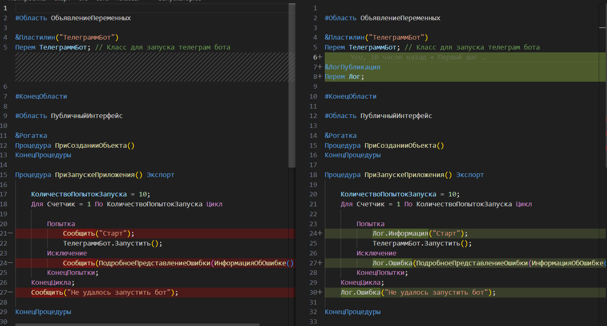

## Работа с интерфейсом

Пора начинать делать то, ради чего все и затевалось, — разбор исходников. Мы предполагаем, что пользователь может прислать в бот или сообщение, или файл.
Думаю, стоит начать с обработки того, что он пришлет. Если пришлет сообщение — скажем, что работаем только с файлами. Если файл — то пойдем и разберем его.

Но как это написать? На ум первое, что приходит, — что надо доработать класс `ТелеграммБот`. Примерно так:

```bsl
Если ЭтоСообщение(Сообщение) Тогда
	// Сообщить, что мы работаем только с файлами
ИначеЕсли ЭтоФайл(Сообщение)
	// Разобрать и вернуть исходники
КонецЕсли;
```

Но я предлагаю пойти по-другому пути: вдруг мы будем развивать наше решение, и у нас будет больше вариантов работы с сообщениями — писать все в одном классе неудобно. Возьмем паттерн «Команда» и попробуем его применить.

Идея следующая: мы получаем от бота «сообщение», проверяем по условиям, какая команда нам подходит. Та команда, которая подошла, занимается обработкой сообщения и либо отправляет в Менеджер публикаций, либо, например, сообщает: «В данный момент обработка текстовых сообщений не поддерживается».

Попробуйте написать это сами, а потом сравним :)

<details>
<summary>Диаграмма классов v2</summary>

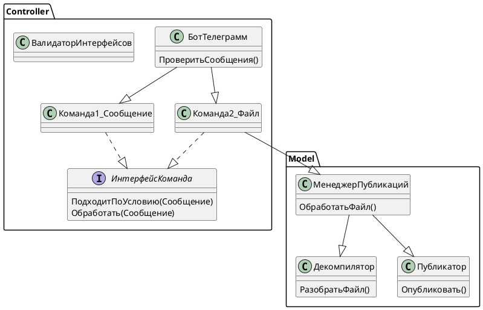
</details>


Новые команды:

<details>
<summary>Новые команды:</summary>

```bsl
// src\controller\Классы\КомандаСообщение.os

#Использовать oint

#Область ОбъявлениеПеременных

&Деталька("TELEGRAMM.TOKEN")
Перем Токен;

#КонецОбласти

#Область ПрограммныйИнтерфейс

&Желудь
&Прозвище("Команда")
&Реализует("ИнтерфейсКоманда")
Процедура ПриСозданииОбъекта()
	
КонецПроцедуры

Функция ПодходитПоУсловию(Сообщение) Экспорт
	
	Подходит = Сообщение.Получить("message") <> Неопределено И Сообщение["message"].Получить("document") = Неопределено;
	Возврат Подходит;
	
КонецФункции

&Асинх
Процедура Обработать(Сообщение) Экспорт

	ЧатИД = Сообщение["message"]["chat"]["id"];
	OPI_Telegram.ОтправитьТекстовоеСообщение(Токен, ЧатИД, 
		"В данный момент обработка текстовых сообщений не поддерживается.");

КонецПроцедуры

#КонецОбласти
```

```bsl
// src\controller\Классы\КомандаФайл.os

#Использовать oint

#Область ОбъявлениеПеременных

&Деталька("TELEGRAMM.TOKEN")
Перем Токен;

&Деталька("FILEMAXSIZE")
Перем МаксимальныйРазмерФайла;

&Пластилин
Перем МенеджерПубликаций;

&ЛогПубликация
Перем Лог;

#КонецОбласти

#Область ПрограммныйИнтерфейс

&Желудь
&Прозвище("Команда")
&Реализует("ИнтерфейсКоманда")
Процедура ПриСозданииОбъекта()
	
КонецПроцедуры

Функция ПодходитПоУсловию(Сообщение) Экспорт
	
	Подходит = Сообщение.Получить("message") <> Неопределено И Сообщение["message"].Получить("document") <> Неопределено;
	Возврат Подходит;
	
КонецФункции

Процедура Обработать(Сообщение) Экспорт
	
	ЧатИД = Сообщение["message"]["chat"]["id"];
	ИДПользователя = Сообщение["message"]["from"]["id"];
	ИмяФайла = Сообщение["message"]["document"]["file_name"];
	ИДФайла = Сообщение["message"]["document"]["file_id"];

	Попытка
		ФайлВалидный(Сообщение);
	Исключение
		Информация = ИнформацияОбОшибке();
		OPI_Telegram.ОтправитьТекстовоеСообщение(Токен, ЧатИД, Информация.Описание);
		Возврат;
	КонецПопытки;

	ДвоичныеДанные = OPI_Telegram.СкачатьФайл(Токен, ИДФайла);	
	НомерСообщения = Сообщение["update_id"];

	ДанныеДляРазбораФайла = МенеджерПубликаций.НовыйДанныеДляРазбораФайла();	
	ДанныеДляРазбораФайла.ИДПользователя = ИДПользователя;
	ДанныеДляРазбораФайла.ИмяФайла = ИмяФайла;
	ДанныеДляРазбораФайла.НомерСеанса = НомерСообщения;	
	ДанныеДляРазбораФайла.ДвоичныеДанные = ДвоичныеДанные;	
	ДанныеДляРазбораФайла.ИДФайла = ИДФайла;
	ДанныеДляРазбораФайла.Обновление = Ложь;

	ТекстОтвета = МенеджерПубликаций.ОбработатьФайл(ДанныеДляРазбораФайла);
	OPI_Telegram.ОтправитьТекстовоеСообщение(Токен, ЧатИД, ТекстОтвета);
	
	Лог.Отладка(ТекстОтвета);

КонецПроцедуры

#КонецОбласти

#Область СлужебныеПроцедурыИФункции

Процедура ФайлВалидный(Сообщение)
	
	РазмерФайла = Сообщение["message"]["document"]["file_size"];
	ИмяФайла = Сообщение["message"]["document"]["file_name"];
	Если РазмерФайла > МаксимальныйРазмерФайла Тогда
		ВызватьИсключение "Мы пока не принимаем большие файлы";
	КонецЕсли;
	               
	Расширение = СтрРазделить(ИмяФайла, ".");
	Если НЕ РаботаСМодулями.ДопустимоеРасширение(Расширение[Расширение.ВГраница()]) Тогда
		ВызватьИсключение "Текущее расширение файла не поддерживается";
	КонецЕсли;

КонецПроцедуры

#КонецОбласти
```
</details>

Добавил общий модуль

<details>
<summary>src\core\Модули\РаботаСМодулями.os</summary>

```bsl
// src\core\Модули\РаботаСМодулями.os

#Область ПрограммныйИнтерфейс

Функция ДопустимоеРасширение(Расширения) Экспорт
    
    Возврат ВалидныеРасширения().Найти(Расширения) <> Неопределено;
    
КонецФункции

#КонецОбласти

#Область СлужебныеПроцедурыИФункции

Функция ВалидныеРасширения()
    
    Расширения = Новый Массив;
    Расширения.Добавить("epf");
    Расширения.Добавить("ert");
    Расширения.Добавить("cf");
    Расширения.Добавить("cfe");
    Возврат Расширения;
    
КонецФункции

КонецФункции

#КонецОбласти
```
</details>

Теперь поменяем наш `ТелеграммБот` с учетом команд:

<details>
<summary>src\controller\Классы\ТелеграммБот.os</summary>

```bsl
// src\controller\Классы\ТелеграммБот.os

#Использовать oint 

#Область ОбъявлениеПеременных

&ЛогПубликация
Перем Лог;

&Деталька("TELEGRAMM.TOKEN")
Перем Токен;

&Пластилин("Команда", Тип = "Массив")
Перем Команды;

&Число
Перем Смещение;

Перем Токен;

#КонецОбласти

#Область ПубличныйИнтерфейс

&Желудь
Процедура ПриСозданииОбъекта()
	
КонецПроцедуры

Процедура Запустить() Экспорт

	Лог.Информация("Запущен");

	Пока Истина Цикл
		
		Ответ = OPI_Telegram.ПолучитьОбновления(Токен, 30, Смещение);
		Результат = Ответ["result"];
		
		Если Результат = Неопределено ИЛИ Результат.ВГраница() = -1 Тогда
			Продолжить;
		Иначе
			Сообщение = Результат[Результат.ВГраница()];
			Смещение = Сообщение["update_id"] + 1;
		КонецЕсли;

		Для Каждого Команда Из Команды Цикл
			Если Команда.ПодходитПоУсловию(Сообщение) Тогда
				Команда.Обработать(Сообщение); 
				Прервать;
			КонецЕсли;
		КонецЦикла;

	КонецЦикла;
	
КонецПроцедуры

#КонецОбласти
```
</details>

Тут есть что обсудить.
Во-первых, так как я планирую в будущем использовать больше команд, я заложил под это основу.
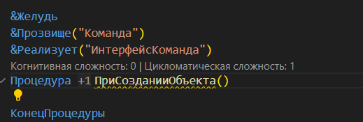

Командам я дал прозвище — [алиасы](https://autumn-library.github.io/framework-elements/aliases-grouping). Теперь я могу обращаться сразу ко всем желудям с одинаковым прозвищем, например обходить их в цикле. Если бы не эта возможность, мне пришлось бы реализовывать паттерны [фабрики](https://javarush.com/groups/posts/2370-pattern-proektirovanija-factory) и [стратегии](https://javarush.com/groups/posts/2271-pattern-proektirovanija-strategija), например. Тут же Осень все взяла на себя!

> &Пластилин("Команда", Тип = "Массив")
> Перем Команды;

Для работы с командами я определил единый интерфейс, теперь я хочу, чтобы он проверялся, ну как во «взрослых» языках. ))

Для этого есть библиотека `extends`, я создал класс `ВалидаторИнтерфейсов.os`.

<details>
<summary>src\core\Классы\ВалидаторИнтерфейсов.os</summary>

```bsl
// src\core\Классы\ВалидаторИнтерфейсов.os

#Использовать extends

&Приемка
Процедура ПриСозданииОбъекта()
КонецПроцедуры

Процедура ПриДобавленииОпределенияЖелудя(ОпределениеЖелудя) Экспорт
	
	Если ЕстьИнтерфейс(ОпределениеЖелудя.Прозвища()) Тогда
		ВалидаторРеализации = Новый ВалидаторРеализации();
		ВалидаторРеализации.ИнтерфейсыРеализованыКорректно(ОпределениеЖелудя.ТипЖелудя());
	КонецЕсли;

КонецПроцедуры

Функция ВалидируемыеИнтерфейсы() 
	
	Результат = Новый Массив;
	Результат.Добавить("Команда");
	Возврат Результат;

КонецФункции

Функция ЕстьИнтерфейс(Прозвища) Экспорт
	
	Для каждого ИмяИнтерфейса Из ВалидируемыеИнтерфейсы() Цикл
		Если Прозвища.Найти(ИмяИнтерфейса) <> Неопределено Тогда
			Возврат Истина;
		КонецЕсли;
	КонецЦикла;
			
	Возврат Ложь;
	
КонецФункции
```
</details>

В нем я проверяю интерфейс всех команд, которые были добавлены с одинаковым прозвищем. Также заложил возможность расширять валидируемые интерфейсы (`ВалидируемыеИнтерфейсы()`), но теперь надо понять момент, когда нужно выполнять эту проверку. На помощь приходит аннотация `&Приемка`.

> Специальный тип желудя для обработки определений желудей.
>
> Аналог &Напильника для `ОпределениеЖелудя`. Срабатывает каждый раз, когда в контекст добавляется новое
> определение желудя. При добавлении самой Приемки в контекст, все ранее добавленные определения желудей
> передаются в Приемку для проверки.

Когда в `ПриДобавленииОпределенияЖелудя` попадает желудь, мы проверяем его прозвище, и если прозвище «Команда», мы проверяем его интерфейс на соответствие специальному классу `ИнтерфейсКоманда.os`, у которого должна быть аннотация `&Интерфейс` и требуемые методы. Важно: тут также учитывается количество параметров.

<details>
<summary>src\controller\Классы\ИнтерфейсКоманда.os</summary>

```bsl
// src\controller\Классы\ИнтерфейсКоманда.os

&Интерфейс
Процедура ПриСозданииОбъекта()
КонецПроцедуры

Процедура Обработать(Сообщение) Экспорт
КонецПроцедуры

Функция ПодходитПоУсловию(Сообщение) Экспорт
	Возврат Ложь;
КонецФункции 
```
</details>

Если обратили внимание, то, наверное, заметили, как передаются параметры с команды до менеджера публикаций. В менеджере публикаций я определяю ДТО для обмена данными между нашими слоями (грубо говоря, структуру) — `МенеджерПубликаций.НовыйДанныеДляРазбораФайла();`. Я решил передавать на слой логики побольше информации, а не только двоичные данные. Позже, думаю, мне это понадобится.

Также внимательный читатель увидел аннотацию `&Число` — это тоже одна из «фишек» фреймворка Осени — типизировать переменные. Для того чтобы это использовать, нам нужно подключить `autumn-annotation-types`.

<details>
<summary>main.os</summary>

```bsl
// main.os

#Использовать "./src/core"
#Использовать "./src/controller"
#Использовать autumn
#Использовать autumn-logos
#Использовать autumn-annotation-types

Поделка = Новый Поделка();
Поделка.ЗапуститьПриложение();
```
</details>

Текущий вид проекта

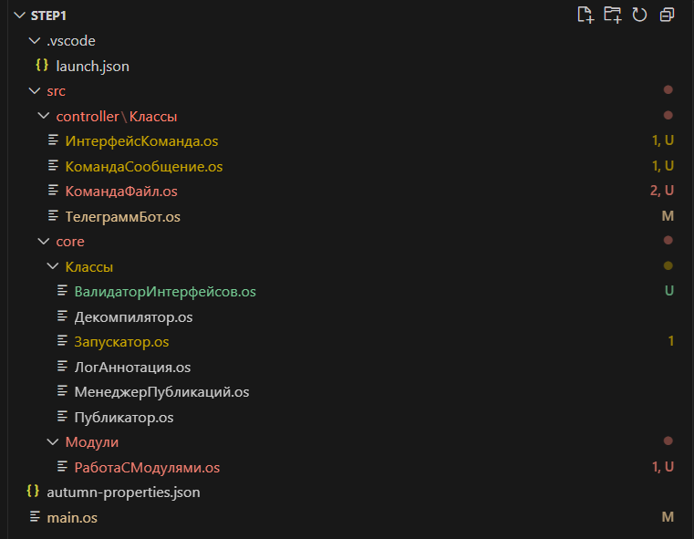

Также изменения можно легко отследить по коммитам репозитория — я постарался фиксировать доработки шагами. [Коммиты](https://github.com/Untru/share-bsl-step/commits/master/)

## Разбор бинарников

Мы подошли к теме разбора бинарников. На текущий момент я знаю следующие методы:
+ С помощью платформы 1С в пакетном режиме
+ С помощью утилиты `ibcmd`
+ С помощью библиотеки `v8unpack`
+ С помощью saby v8unpack — консольная утилита для сборки и распаковки.

Мой выбор пал на последний вариант: «пакетник» работает долго, с `ibcmd` у меня свои счеты, а библиотека `v8unpack` раскрывает исходники до уровня, когда все файлы представлены в виде идентификаторов.

Для того чтобы разбирать файлы, я создал две папки — куда буду класть исходники и куда все буду распаковывать. Чтобы папки были в репозитории даже когда они пустые, я поместил в них пустой файл `.gitkeep`.

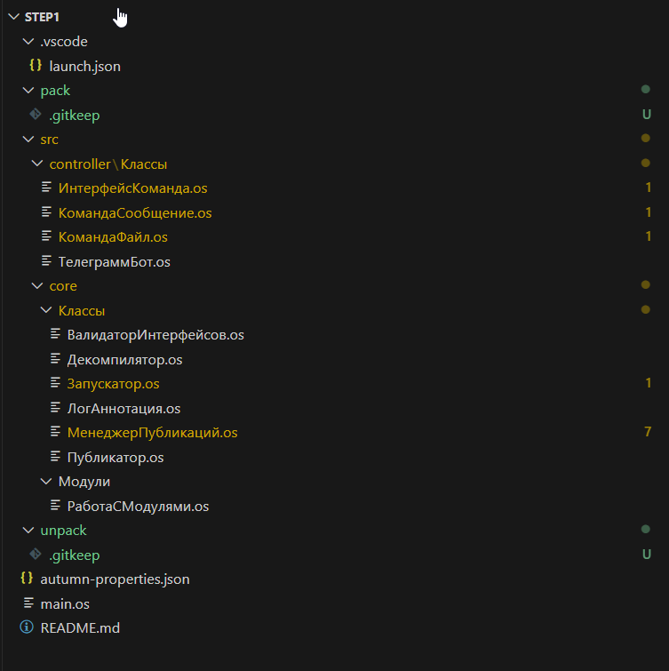

Давайте подумаем, с какими сложностями мы можем столкнуться?

Верно. Что будет, если с ботом будут общаться параллельно, а файлы будут одинаково называться? Чтобы их разделить, я решил использовать номер сообщения как «идентификатор» сеанса.

<details>
<summary>src\core\Классы\МенеджерПубликаций.os</summary>

```bsl
src\core\Классы\МенеджерПубликаций.os

...

Функция ОбработатьФайл(ДанныеДляРазбораФайла) Экспорт

	Каталог = "unpack/" + ДанныеДляРазбораФайла.НомерСеанса;
	КаталогИсходник = "pack/" + ДанныеДляРазбораФайла.НомерСеанса;
	
	СоздатьКаталог(Каталог);
	СоздатьКаталог(КаталогИсходник);

	ПутьКФайлу = СтрШаблон("%1/%2", КаталогИсходник, ДанныеДляРазбораФайла.ИмяФайла);
	
	Лог.Информация("Записываем файл");
	ДанныеДляРазбораФайла.ДвоичныеДанные.Записать(ПутьКФайлу);
	
	Лог.Информация("Разбираем файл");
	Декомпилятор.РазобратьФайл(ПутьКФайлу, Каталог);
	
	// УдалитьФайлы(Каталог); На время отладки закомментирую этот код
	// УдалитьФайлы(КаталогИсходник);
	
	Возврат ДанныеПубликации.СсылкаНаПубликацию;

КонецФункции

```
</details>

Изначально я взял декомпилятор из релизов в виде exe-исполняемого файла. Какие это наложит ограничения? Верно! 

Я не смогу использовать этот функционал в Docker, поэтому я реализовал два варианта: один — с помощью `exe` (нативно может запуститься на Windows), и `py`-скрипт, требующий установки Python.

Добавил настройку в `autumn-properties.json`. На уровне соглашения нужно договориться, что настройка `"UNPACK"` будет иметь два значения: `"py"` и `exe`
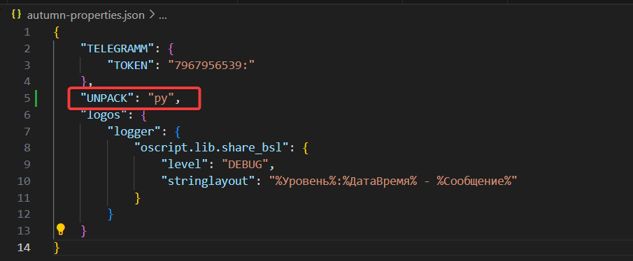

<details>
<summary>src\core\Классы\ПарамертыДекомпилятора.os</summary>

```bsl
src\core\Классы\ПарамертыДекомпилятора.os

#Использовать 1commands

#Область ПрограммныйИнтерфейс

&Дуб
Процедура ПриСозданииОбъекта()
КонецПроцедуры

&Завязь(Тип = "Строка")
&Характер("Компанейский")
Функция КомандаЗапускаДекомпилятора(&Деталька(Значение = "UNPACK", ЗначениеПоУмолчанию = "py") 
					КомандаЗапускаДекомпилятора, &Блестяшка ПутьКФайлу, &Блестяшка ПапкаРазбора) Экспорт
	
	Команда = Новый Команда;

	Если КомандаЗапускаДекомпилятора = "py" Тогда
		ИсполняющийСкрипт = ТекущийКаталог() + "/src/v8unpack/v8u.py";
		Команда.УстановитьКоманду("python3");
		Команда.ДобавитьПараметр(ИсполняющийСкрипт);	
	Иначе
		Команда.УстановитьКоманду("src/v8unpack/v8unpack.exe");
		Команда.ДобавитьПараметр("-E");	
	КонецЕсли;

	Команда.ДобавитьПараметр(Команда.ОбернутьВКавычки(ПутьКФайлу));	
	Команда.ДобавитьПараметр(ПапкаРазбора);

	Возврат Команда;

КонецФункции

#КонецОбласти
```
</details>

Я решил сделать компанейский желудь. Что это значит? При получении его я буду получать новый экземпляр класса, так как у него по-разному будут заполнены свойства пути к файлу. Поля, которые будут заполняться по-разному в конструкторе, я отметил с помощью аннотации [`&Блестяшка`](https://autumn-library.github.io/single-page/autumn#%D0%BF%D1%80%D0%BE%D0%B8%D0%B7%D0%B2%D0%BE%D0%BB%D1%8C%D0%BD%D1%8B%D0%B5-%D0%B0%D1%80%D0%B3%D1%83%D0%BC%D0%B5%D0%BD%D1%82%D1%8B-%D0%BA%D0%BE%D0%BD%D1%81%D1%82%D1%80%D1%83%D0%BA%D1%82%D0%BE%D1%80%D0%B0). Теперь, когда я буду «доставать» свой желудь, я буду дозаполнять его поля:

<details>
<summary>src\core\Классы\Декомпилятор.os</summary>

```bsl
// src\core\Классы\Декомпилятор.os

#Использовать 1commands

#Область ОбъявлениеПеременных

&Деталька("UNPACK")
Перем СпособРазбора; // Метод: разбирать через exe или через Python; варианты: exe, py

&ЛогПубликация
Перем Лог;

&Табакерка 
&Пластилин
Перем КомандаЗапускаДекомпилятора;

#КонецОбласти

#Область ПрограммныйИнтерфейс

&Желудь
Процедура ПриСозданииОбъекта()
	
КонецПроцедуры

Процедура РазобратьФайл(ПутьКФайлу, ПапкаРазбора) Экспорт
	
	Параметры = Новый Массив;
	Параметры.Добавить(ПутьКФайлу);	
	Параметры.Добавить(ПапкаРазбора);

	КомандаЗапуска = КомандаЗапускаДекомпилятора.Достать(Параметры);
	
	КодВозврата = КомандаЗапуска.Исполнить();
	Лог.Отладка(КомандаЗапуска.ПолучитьВывод());
	Лог.Отладка(КодВозврата);

КонецПроцедуры

#КонецОбласти
```
</details>
Теперь обратим внимание, что такой желудь надо пометить аннотацией `&Табакерка`. А в момент использования мы вызываем код: `КомандаЗапускаДекомпилятора.Достать(Параметры);`.

Обоснование, почему я использовал дуб? TODO

## Публикация файлов

### Как удобно просматривать код на телефоне?

**Вариант 1:** Отправлять сырой текст в Telegram.
**Минусы:** Нечитаемо, ограничение на 3000 символов.

**Вариант 2:** Использовать [Paste1C](https://paste1c.ru/). Замечательный сервис Paste 1C, где изначально я все и реализовал.
**Минусы:** Что делать, когда у обработки несколько форм и модуль объекта — кидать много ссылок? Это не всегда удобно, особенно когда файлов много.

**Вариант 3:** Файлообменники.
**Минусы:** Неудобно для быстрого просмотра.

**Вариант 4:** Gist GitHub.
- Позволяет сравнивать правки между версиями.
- Есть доступ по ссылке (аналог Google Docs). Код виден только тем, кому вы дали ссылку.
**Минусы:** Тоже есть ограничения, вроде 100 файлов.

**Вариант 5:** Репозиторий.
**Минусы:** Нет возможности создавать доступ по ссылке: или всем видно, или приватно с добавлением доступов.

**Итог:** Я выбрал вариант 4, но надо сделать так, чтобы легко можно было расширить возможности и публиковать еще куда-то.

Мы уже знаем, как нам работать с разными классами, которые объединены одним алиасом:
+ Добавляем нужный интерфейс в валидатор


<details>
<summary>src\core\Классы\ВалидаторИнтерфейсов.os</summary>

```bsl
src\core\Классы\ВалидаторИнтерфейсов.os

...
Функция ВалидируемыеИнтерфейсы() 
	
	Результат = Новый Массив;
	Результат.Добавить("Команда");
	Результат.Добавить("Публикатор");
	Возврат Результат;

КонецФункции
```
</details>
+ Добавляем описание интерфейса

<details>
<summary>Описание интерфейса</summary>

```bsl
// src\core\Классы\ИнтерфейсПубликатор.os

&Интерфейс
Процедура ПриСозданииОбъекта()
КонецПроцедуры

Функция Опубликовать(ТекстыМодулей, ДанныеДляРазбораФайла) Экспорт
	Возврат Ложь;
КонецФункции
```
</details>

+ Добавляем классы для публикации

<details>
<summary>Классы публикаторы</summary>

```bsl
// src\core\Классы\ПубликаторGist.os

#Использовать 1connector

#Область ОбъявлениеПеременных

&Деталька("GIST.TOKEN")
Перем Токен;

&Деталька("GIST.NAME")
Перем Имя;

&ЛогПубликация
Перем Лог;

#КонецОбласти

&Желудь
&Прозвище("Публикатор")
&Реализует("ИнтерфейсПубликатор")
Процедура ПриСозданииОбъекта()
	
КонецПроцедуры

Функция Опубликовать(ТекстыМодулей, ДанныеДляРазбораФайла) Экспорт
	
	Ссылки = Новый Соответствие();
	АдресРесурса = АдресРесурса();
	
	Заголовки = Новый Структура();
	Заголовки.Вставить("Authorization", "token " + Токен);
	
	ФайлыДляAPI = Новый Соответствие();
	Для Каждого Файл Из ТекстыМодулей Цикл
		Если НЕ ЗначениеЗаполнено(Файл.Значение) Тогда
			Лог.Отладка("Файл не содержит данных для публикации: " + Файл.Ключ);
			Продолжить;
		КонецЕсли;
		ФайлДанные = Новый Соответствие();
		ФайлДанные.Вставить("content", Файл.Значение);
		ФайлыДляAPI.Вставить(Файл.Ключ, ФайлДанные);
		
	КонецЦикла;
	
	Тело = Новый Соответствие();
	Тело.Вставить("files", ФайлыДляAPI);
	Тело.Вставить("public", Ложь);
	Тело.Вставить("description", "Gist создан из 1С " + ТекущаяДата());
	
	Если ДанныеДляРазбораФайла.Обновление Тогда
		Ответ = КоннекторHTTP.Patch(СтрШаблон("%1/%2", АдресРесурса, ДанныеДляРазбораФайла.ИДПубликации),
				ОбъектВJson(Тело), Новый Структура("Заголовки", Заголовки)
			);
	Иначе
		Ответ = КоннекторHTTP.Post(АдресРесурса, , Тело, Новый Структура("Заголовки", Заголовки));
	КонецЕсли;
	
	Если КодСостоянияУспешный(Ответ.КодСостояния) Тогда
		ОтветJson = Ответ.Json();
	Иначе
		Лог.Ошибка("Не удалось опубликовать файл в Gist: Код состояния" + Ответ.КодСостояния);
		ВызватьИсключение "Не удалось опубликовать файл в Gist: Код состояния" + Ответ.КодСостояния;
	КонецЕсли;
	
	Оглавление = ОглавлениеПоДаннымGist(ОтветJson);
	АдресРесурса = СтрШаблон("%1/%2", АдресРесурса, ОтветJson["id"]);
	
	ФайлДанные = Новый Соответствие();
	ФайлДанные.Вставить("content", Оглавление);
	ФайлыДляAPI.Вставить("Contents.md", ФайлДанные);
	
	Тело = Новый Соответствие();
	Тело.Вставить("files", ФайлыДляAPI);
	Тело.Вставить("public", Ложь);
	Тело.Вставить("description", "Gist создан из 1С " + ТекущаяДата());
	
	Ответ = КоннекторHTTP.Patch(АдресРесурса, ОбъектВJson(Тело), Новый Структура("Заголовки", Заголовки));
	Если КодСостоянияУспешный(Ответ.КодСостояния) Тогда
		ОтветJson = Ответ.Json();
		Ссылки.Вставить(ОтветJson["id"], ОтветJson["html_url"] + "#file-contents-md");
	КонецЕсли;
	
	Возврат Ссылки;
	
КонецФункции

Функция АдресРесурса()
	
	Возврат "https://api.github.com/gists";
	
КонецФункции

Функция ОбъектВJson(Объект)
	
	ЗаписьJSON = Новый ЗаписьJSON;
	ЗаписьJSON.УстановитьСтроку();
	ЗаписатьJSON(ЗаписьJSON, Объект);
	
	Возврат ЗаписьJSON.Закрыть();
	
КонецФункции

// Актуально на момент тестов, так как у меня очень много публикаций было создано
Процедура УдалитьВсеПубликации() Экспорт
	
	Заголовки = Новый Структура();
	Заголовки.Вставить("Authorization", "token " + Токен);
	Адрес = СтрШаблон("https://api.github.com/users/%1/gists", Имя);
	Гисты = КоннекторHTTP.Get(Адрес, , Новый Структура("Заголовки", Заголовки)).Json();
	
	Для Каждого Гист Из Гисты Цикл
		Ответ = КоннекторHTTP.delete("https://api.github.com/gists/" + Гист["id"], , ,
				Новый Структура("Заголовки", Заголовки)
			);
	КонецЦикла;
	
КонецПроцедуры

Функция КодСостоянияУспешный(КодСостояния)
	
	КодыОтвета = Новый Массив;
	КодыОтвета.Добавить(200);
	КодыОтвета.Добавить(201);
	
	Возврат КодыОтвета.Найти(КодСостояния) <> Неопределено;
	
КонецФункции

Функция ОглавлениеПоДаннымGist(Данные)
	
	Дерево = РаботаСМодулями.ДеревоОбъектов(Данные);
	
	Результат = "# Дерево файлов
		|
		|";
	
	Для Каждого КлючИЗначение Из Дерево Цикл
		ТипОбъекта = КлючИЗначение.Ключ;
		Объекты = КлючИЗначение.Значение;
		
		ТекстовоеОписаниеОбъектов = Новый Массив;
		Для Каждого КлючИЗначение2 Из Объекты Цикл
			ИмяОбъекта = КлючИЗначение2.Ключ;
			Модули = КлючИЗначение2.Значение;
			СсылкиНаМодули = Новый Массив();
			Для Каждого Модуль Из Модули Цикл
				СсылкиНаМодули.Добавить(СтрШаблон("- [%1](%2)", Модуль.Описание, Модуль.Ссылка));
			КонецЦикла;
			
			ТекстовоеОписаниеОбъектов.Добавить(СтрШаблон("
					| %1
					|%2
					|", ИмяОбъекта, СтрСоединить(СсылкиНаМодули, Символы.ПС)));
			
		КонецЦикла;
		
		Результат = Результат + СтрШаблон("
				|<details>
				| <summary><strong> %1 </strong></summary>
				|%2
				|</details>", ТипОбъекта, СтрСоединить(ТекстовоеОписаниеОбъектов, Символы.ПС));
		
	КонецЦикла;
	Возврат Результат;
	
КонецФункции

```

```bsl
// src\core\Классы\ПубликаторPaste1C.os

#Использовать 1connector

&Деталька("PASTE1C.HEADER")
Перем HEADER;


&Желудь
&Прозвище("Публикатор")
&Реализует("ИнтерфейсПубликатор")
Процедура ПриСозданииОбъекта()
	
КонецПроцедуры

Функция Опубликовать(ТекстыМодулей, ДанныеДляРазбораФайла) Экспорт
	// TODO: Продумать удобный способ работы с paste1c. Главная проблема в том, что 
	// разные модули будут публиковаться по разным ссылкам, что неудобно для анализа
	Ссылки = Новый Массив;

	АдресРесурса = АдресРесурса();
	
	Заголовки = Новый Соответствие();
	Заголовки.Вставить("API-origin", HEADER);
	
	Для Каждого Текст Из ТекстыМодулей Цикл
		
		Тело = НовыйСообщение();
		Тело["Shared"]["title"] = Текст.Ключ;
		Тело["Shared"]["code"] = Текст.Значение;	

		Ответ = КоннекторHTTP.Post(АдресРесурса,, Тело, Новый Структура("Заголовки", Заголовки));
		ОтветJson = Ответ.Json();

		Ссылки.Вставить(ОтветJson["id"], ОтветJson["full_url"]);
	КонецЦикла;
	
	Возврат Ссылки;
	
КонецФункции

Функция НовыйСообщение()

	СоставТела = Новый Соответствие();
	СоставТела.Вставить("title", "");
	СоставТела.Вставить("description", "Код создан из 1С " + ТекущаяДата());
	СоставТела.Вставить("context", "");
	СоставТела.Вставить("code", "");
	СоставТела.Вставить("query_mode", 0);
	
	Тело = Новый Соответствие();
	Тело.Вставить("Shared", СоставТела);

	Возврат Тело;

КонецФункции

Функция АдресРесурса()

	Возврат "https://paste1c.ru/paste";

КонецФункции
```
</details>

Не буду подробно останавливаться на коде, только скажу, что я тут использую библиотеку `1connector`, чтобы упростить написание запросов.

Также в настройки я добавил свойство `"SHARESERVICE": ["ПубликаторGist", "ПубликаторЕщеКакойНибудь"]`, чтобы на их уровне мы могли определять, где будет публиковаться код. Если что-то из листинга непонятно — пишите в комментарии, и я расширю статью пояснениями.

Также для Gist я реализовал разбор списка файлов и формирование оглавления, чтобы проще было в них орентироваться, пишу в отдельный gist .
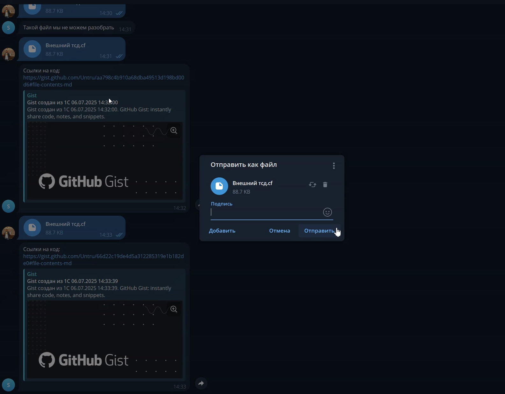


## Подключаем базу данных

У нас с вами почти все готово: файлы отправляются, код присылается — чего еще желать?

Давайте смоделируем такую ситуацию: мне отправляют обработку, я ее смотрю и оставляю свои комментарии. Программист правит код и отправляет обратно — было бы удобно заменять публикацию новой. Мало того, возможности Gist нам покажут, какой код был изменен.
Но как это сделать? Нам же надо хранить где-то информацию о том, какие публикации были уже отправлены. Предлагаю подключить к нашему боту базу данных. И тут тоже Осень готова нам помочь.

Нарисуем взаимодействие пользователя с Telegram.
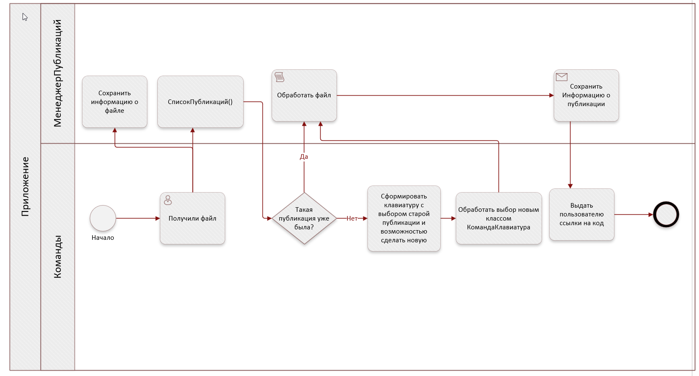
+ Будем сохранять публикации — тогда, когда в следующий раз нам нужно будет ее обновить, мы будем знать какую.
+ Будем сохранять информацию о входящем файле, так как с ним мы будем взаимодействовать уже после того, как показали клавиатуру.

Итого, нам нужно две таблицы: `ИсторияПубликаций` и `ИсторияФайлов`.

Подключаем библиотеку [autumn-data](https://autumn-library.github.io/autumn-data/). Для этого нам нужно создать описание таблиц — сделаем это в новой папке `data`.

Внесем настройки для работы с библиотекой в `autumn-properties.json`:

```JSON
    "data": {
        "ИсточникиДанных": {
            "ТипКоннектора": "КоннекторJSON",
            "СтрокаСоединения": "./DataBase"
        }
    },
```

<details>
<summary>Описание таблиц</summary>

```bsl
// src\data\Классы\ИсторияПубликаций.os

// BSLLS:ExportVariables-off
&Идентификатор
&ГенерируемоеЗначение			// Заполняется автоматически при сохранении сущности
&Колонка(Тип = "Целое")			// Хранит целочисленные значения
Перем Идентификатор Экспорт;	// Имя колонки в базе - `Идентификатор`

&Колонка(Тип = "Целое")
Перем ИДПользователя Экспорт;	// Колонка `ИДПользователя`

&Колонка(Тип = "Строка")
Перем ИмяФайла Экспорт;			// Колонка `ИмяФайла`

&Колонка(Тип = "ДатаВремя")
Перем ДатаОтправки Экспорт;			// Колонка `ДатаОтправки`

&Колонка(Тип = "Строка")
Перем ИДПубликации Экспорт;			// Колонка `ИДПубликации`

&Колонка(Тип = "Строка")
Перем ИДФайла Экспорт;			// Колонка `ИДФайла`

&Сущность(ИмяТаблицы = "ИсторияПубликаций")
Процедура ПриСозданииОбъекта()

КонецПроцедуры
```


```bsl
// src\data\Классы\ИсторияФайлов.os

// BSLLS:ExportVariables-off
&Идентификатор
&ГенерируемоеЗначение
&Колонка(Тип = "Целое")	
Перем Идентификатор Экспорт;

&Колонка(Тип = "Строка")
Перем ИДФайла Экспорт;

&Колонка(Тип = "Строка")
Перем ИмяФайла Экспорт;

&Сущность(ИмяТаблицы = "ИсторияФайлов")
Процедура ПриСозданииОбъекта()


КонецПроцедуры
```
</details>

У меня в VS Code подключен BSLLS, и он ругается, что нужно описать значение переменных. Мне кажется, тут это делать излишним. Чтобы он не ругался, предлагаю отключить в этом файле эту проверку — `// BSLLS:ExportVariables-off`. Обратите внимание на аннотации `&Идентификатор` и `&ГенерируемоеЗначение`: при записи в таблицу мы автоматически будем генерировать идентификатор.

Теперь мы должны описать логику записи и получения данных из таблиц. Покажу на примере таблицы `ИсторияПубликаций`.
<details>
<summary>src\data\Классы\ХранилищеИсторияПубликаций.os</summary>

```bsl
// src\data\Классы\ХранилищеИсторияПубликаций.os

// BSLLS:UnusedParameters-off
#Область ОбъявлениеПеременных

&Родитель
Перем ХранилищеСущностей;

#КонецОбласти

#Область ПрограмныйИнтерфейс

&ХранилищеСущностей("ИсторияПубликаций")
Процедура ПриСозданииОбъекта()
КонецПроцедуры

&МетодЗапроса
Функция ПолучитьОдноПоИдентификаторРавно(Идентификатор) Экспорт
	Возврат Неопределено;
КонецФункции

&МетодЗапроса
Функция ПолучитьПоИДПользователяРавноИИмяФайлаРавно(ИДПользователя, ИмяФайла) Экспорт
    Возврат Неопределено;
КонецФункции

Функция СохранитьЗаписьОФайле(ДанныеФайла) Экспорт

	ИсторияПубликаций = ХранилищеСущностей.СоздатьЭлемент();
	ИсторияПубликаций.ИДПользователя = ДанныеФайла.ИДПользователя;
	ИсторияПубликаций.ИмяФайла = ДанныеФайла.ИмяФайла;	
	ИсторияПубликаций.ДатаОтправки = ТекущаяДата();	
	ИсторияПубликаций.ИДПубликации = ДанныеФайла.ИДПубликации;	
	ИсторияПубликаций.ИДФайла = ДанныеФайла.ИДФайла;
	
	ИсторияПубликаций.Сохранить();
	
	Возврат ИсторияПубликаций;

КонецФункции

#КонецОбласти
```
</details>

К этому классу можно относиться, как, например, мы относимся в 1С к модулю менеджера. [`&МетодЗапроса`](https://autumn-library.github.io/autumn-data/query-methods) — это аннотация, которая позволяет генерировать необходимый нам запрос «под капотом». Например, `ПолучитьПоИДПользователяРавноИИмяФайлаРавно()` позволяет найти запись по двум полям, и нет необходимости описывать отборы.

## Асинхронное выполнение

До сих пор у нас была обработка в один поток, то есть если кто то кидает большой файл, другие должны его подождать. Я думаю что это не дело, давай исправлять! И опять к нам на помощь приходит Осень и ее библиотека [`autumn-async`](https://autumn-library.github.io/autumn-async/)

Надо всего лишь добавить в `main.os` `#Использовать autumn-async`, а метод который мы хотим запускать асинхронно - пометить аннотацией `&Асинх`, что может быть проще?


## Итоги и домашнее задание

У нас осталось всего несколько шагов до запуска своего бота. 
Надо подготовить `packagedef` — он поможет собрать пакет в Docker-контейнере.


<details>
<summary>packagedef</summary>

```bsl
Описание.Имя("share-bot")
        .Версия("0.0.1")
        .Автор("Чегодаев Павел")
        .АдресАвтора("https://github.com/untru")
        .АдресРепозитория("https://github.com/Untru/share_bsl")
        .Описание("Отправка в Telegram исходников и их разбор")
        .ВерсияСреды("2.0.0-rc.7")
        .ВключитьФайл("src")
        .ВключитьФайл("main.os")
        .ВключитьФайл("packagedef")
        .ЗависитОт("autumn", "4.3.11" )
        .ЗависитОт("oint")
        .ЗависитОт("1connector")
        .ЗависитОт("autumn-annotation-types")
        .ЗависитОт("autumn-async")
        .ЗависитОт("autumn-data")
         
        .ИсполняемыйФайл("main.os", "share-bot")
        ;
```
</details>

Создаем Dockerfile, который на основании образа `onescript:dev` развернется, установим Python, скопируем файлы, относящиеся к проекту, и запустим наш бот.

<details>
<summary>Dockerfile</summary>

```Dockerfile
FROM evilbeaver/onescript:dev
RUN apt-get update
RUN apt-get install -y python3

WORKDIR /app

COPY ./packagedef .

COPY ./src ./src
COPY ./main.os .

RUN opm install opm \
  && opm build . \
  && cp share-bot-*.ospx bot.ospx \
  && opm install -f bot.ospx

CMD ["share-bot"]
```
</details>

docker build -t sharebot -f docker/Dockerfile .
docker run sharebot

Проверяем работоспособность. ТУТ ГИФ

Я обещал домашнее задание? Да! Хороший тон для любого опенсорс-проекта — это наличие тестов. Давайте придумаем тесты для нашего бота и обсудим их в комментариях к статье.

## Упоминание функционала Осени

### Желудь 
Аннотация `&Желудь` используется для регистрации классов в контейнере зависимостей Осени. Примеры использования:
- [Класс ТелеграммБот](#добавляем-бота) — регистрация бота в контейнере
- [Класс Запускатор](#создание-структуры-проекта) — регистрация основного запускающего класса
- [Класс Декомпилятор](#разбор-бинарников) — регистрация класса для разбора файлов
- [Классы публикаторов](#публикация-файлов) — регистрация различных способов публикации

### Приемка
Аннотация `&Приемка` используется в [классе ВалидаторИнтерфейсов](#работа-с-интерфейсом) для обработки определений желудей при их добавлении в контекст. Позволяет валидировать интерфейсы команд и публикаторов.

### Пластилин
Аннотация `&Пластилин` используется для внедрения зависимостей. Примеры:
- [В классе Запускатор](#создание-структуры-проекта) — получение экземпляра ТелеграммБот
- [В классе КомандаФайл](#работа-с-интерфейсом) — получение МенеджерПубликаций
- [В классе ТелеграммБот](#работа-с-интерфейсом) — получение массива команд

### Свои аннотации
Создание собственных аннотаций показано в разделе [Добавляем логирование](#добавляем-логирование) на примере аннотации `&ЛогПубликация` для работы с логами.

### Типизация переменных
Аннотация `&Число` и другие типы используются для типизации переменных. Подключение библиотеки `autumn-annotation-types` описано в разделе [Работа с интерфейсом](#работа-с-интерфейсом).

### Дополнительные возможности Осени
- **Алиасы и прозвища** — группировка классов по функциональности (например, все команды имеют прозвище «Команда»)
- **Компанейские желуди** — создание новых экземпляров с параметрами (используется в [ПарамертыДекомпилятора](#разбор-бинарников))
- **Табакерка** — для желудей, требующих дополнительной настройки перед использованием
- **Рогатка** — точка входа в приложение
- **Деталька** — получение настроек из конфигурационного файла
- **Завязь** — для параметров конструктора
- **Блестяшка** — для произвольных аргументов конструктора

Что у нас получилось в итоге:


Кидаем расширение, публикуем, вносим исправления, например вместо привет - пишем пока, отправляем еще раз и видим все изменения.

[Тут можно зайти на основной репозиторий проекта](https://github.com/Untru/share_bsl)