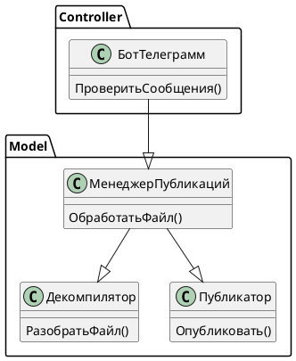
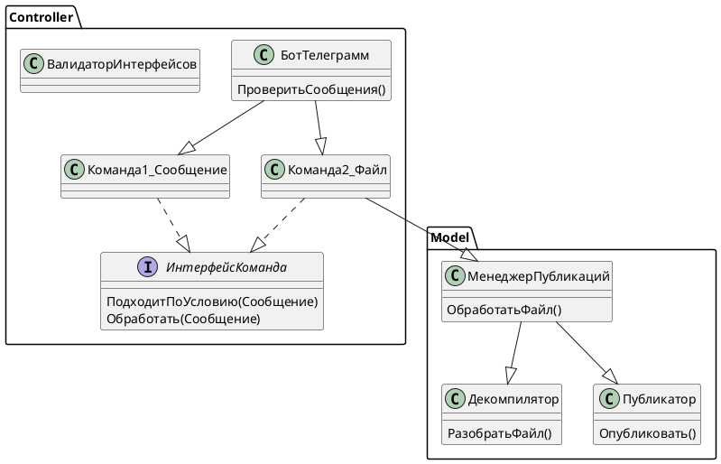

# Мастер-класс: Создание Telegram-бота для декомпиляции 1С файлов на OneScript и Осень

## Введение

Приветствую всех! Меня зовут Чегодаев Павел, и я хочу вместе с вами пройти мастер-класс по разработке бота на OneScript и фреймворка Осень.
На написание этой статьи меня вдохновила публикация [Мастер-класс по созданию приложения](https://infostart.ru/1c/articles/2275659/). Поскольку вторая часть пока не вышла, я возьму на себя смелость продолжить начинания Владимира. 

## Почему Осень?
Есть желание расширять кругозор после 15 лет работы с 1С. В Осени многие концепции заимствованы из [Java](https://infostart.ru/1c/articles/1980026/) — это стало отличным поводом изучить новые подходы, оставаясь в знакомой среде языка 1С.

Поскольку статья про мониторинг возможно когда-нибудь выйдет, я предлагаю взять другую тему.

## Техническое задание

Создать Telegram-бота, который на вход принимает бинарные файлы, а на выходе возвращает исходный код.
Приложение должно быть развертываемо в контейнере Docker.

Чтение кода должно быть реализовано максимально удобно.

## Архитектура
Любая разработка начинается с архитектуры решения. Давайте определим основную функциональность, которая должна быть реализована:

+ Обработка сообщений в боте
+ Разбор файлов на исходники
+ Публикация исходников

Попробуйте самостоятельно нарисовать диаграмму классов, а затем мы сравним результаты.

Как мы все знаем, в прошлом писался код с километровыми методами, которые выполняли множество задач одновременно. Мы не будем следовать такому подходу. Паттернов и подходов к разработке приложений много, но давайте возьмем за основу **MVC**.

Попробуем разделить наше приложение на слои, чтобы они были независимы.

**Что такое MVC:**
- **V (View)** — так как у нас Telegram-бот, то за представление пусть он и отвечает.
- **C (Controller)** — это наш мостик между представлением и бизнес-логикой.
- **M (Model)** — здесь работа с БД и бизнес-логика.

У меня получилось так:


Для удобства я буду диаграммы также оставлять в исходном виде



Давайте создадим структуру проекта. Что бы я ни делал, я всегда начинаю с команды git init, это позволит впоследствии версионировать код и, возможно, поделиться им с вами.

Любое приложение на Осени начинается с точки входа. Создадим файл main.os и другие файлы согласно нашей диаграмме.

Ожидаемая структура:


```bsl 
// main.os

#Использовать "./src/core"
#Использовать "./src/controller"
#Использовать autumn

Поделка = Новый Поделка();
Поделка.ЗапуститьПриложение();
```

Здесь мы сразу подключаем папки /src/controller и /src/core к нашему приложению, а также фреймворк Осень, который впоследствии значительно упростит разработку.

Но что произойдет в момент вызова ЗапуститьПриложение()?

Как сделать, чтобы наш бот заработал? Мы должны создать класс, у которого будет аннотация &Рогатка и метод ПриЗапускеПриложения(), давайте добавим такой класс к нашему проекту.


```bsl 
// src\core\Классы\Запускатор.os

#Область ОбъявлениеПеременных

&Пластилин("ТелеграммБот") 
Перем ТелеграммБот; // Класс для запуска Telegram-бота

#КонецОбласти

#Область ПубличныйИнтерфейс

&Рогатка
Процедура ПриСозданииОбъекта()
КонецПроцедуры

Процедура ПриЗапускеПриложения() Экспорт

	КоличествоПопытокЗапуска = 10;
	Для Счетчик = 1 По КоличествоПопытокЗапуска Цикл
		
		Попытка
			Сообщить("Старт");
			ТелеграммБот.Запустить();
		Исключение
			Сообщить(ПодробноеПредставлениеОшибки(ИнформацияОбОшибке()));
		КонецПопытки;	
	КонецЦикла;
	Сообщить("Не удалось запустить бот");

КонецПроцедуры

#КонецОбласти
```

Теперь разберем код выше. У нас есть класс, который реализует логику общения с Telegram, мы его назвали ТелеграммБот. Чтобы начать работать с этим классом, у нас есть 2 пути:

1) Создать экземпляр в коде:
```bsl
ТелеграммБот = Новый ТелеграммБот;
ТелеграммБот.Запустить()
```

2) Внедрить через механизм внедрения зависимостей Осени, причем внедрять можно 3 разными способами:

Через свойства, как в варианте выше:
```bsl
&Пластилин("ТелеграммБот") 
Перем ТелеграммБот; // Класс для запуска Telegram-бота
```

Через специальный метод сеттер:
```bsl
Перем ТелеграммБот;
&Пластилин
Процедура УстановитьТелеграммБот(Значение) Экспорт
    Пароль = Значение;
КонецПроцедуры
```
или через [конструктор](https://autumn-library.github.io/framework-elements/components-binding)

В каких случаях это может быть полезно?
Например, у нашего класса ТелеграммБот есть поле Токен и разные методы ОтправитьСообщение(), ОтправитьКартинку() и т.д.

В одном месте мы заполняем токен, потом в любых других местах через аннотацию &Пластилин мы получаем экземпляр этого класса, а он уже настроен так, как нам нужно, то есть у него уже заполнено поле токен.


## Добавляем бота

Нам нужно как-то взаимодействовать с ботом, вариантов два: или писать самому, или использовать существующие библиотеки.

Хороший программист стремится использовать готовые решения, давайте использовать готовую библиотеку. Мне нравится библиотека Антона [ОПИ](https://openintegrations.dev/), поражает подход к написанию и развитию этой библиотеки. Внимание ко всем мелочам.

```bsl
// src\controller\Классы\ТелеграммБот.os

#Использовать oint 

#Область ОбъявлениеПеременных

Перем Смещение;

Перем Токен;

#КонецОбласти

#Область ПубличныйИнтерфейс

&Желудь
Процедура ПриСозданииОбъекта()
	
КонецПроцедуры

Процедура Запустить() Экспорт

	Сообщить("Запущен");
	Токен = "7967956539";

	Пока Истина Цикл
		
		Ответ = OPI_Telegram.ПолучитьОбновления(Токен, 30, Смещение);
		Результат = Ответ["result"];
		
		Если Результат = Неопределено ИЛИ Результат.ВГраница() = -1 Тогда
			Продолжить;
		Иначе
			Сообщение = Результат[Результат.ВГраница()];
			Смещение = Сообщение["update_id"] + 1;
		КонецЕсли;

		ОбработатьСообщение(Сообщение);
	КонецЦикла;
	
КонецПроцедуры

#КонецОбласти

#Область СлужебныеПроцедурыИФункции

Процедура ОбработатьСообщение(Сообщение)

	ЧатИД = Сообщение["message"]["chat"]["id"];

	OPI_Telegram.ОтправитьТекстовоеСообщение(Токен, ЧатИД, Сообщение["message"]["text"]);	
КонецПроцедуры

#КонецОбласти
```

Теперь разберем, что тут написано?
 
Мы подключили oint (ОПИ), чтобы использовать уже готовые интеграции с Telegram.
А еще мы подошли к тому что бы обсудить более детально Осень
У метода ПриСозданииОбъекта() установили аннотацию &Желудь, так мы указали, что этот класс мы можем получить в любой момент из Контейнера, создаваемого Осенью, например, как мы сделали в классе Запускатор.

Когда мы пишем &Пластилин - мы получаем экземпляр нашего объекта.
Как можно более простым языком это описать? Если ОЧЕНЬ грубо, то, давайте представим, что у нас есть глобальный контетекст и есть глобальная переменная Соответствие
Ключ - Имя класса, Значение - сам объект, в любом месте мы можешь получить его и использовать.


## Предварительные итоги

На этом этапе у нас с вами готова основа, наш бот даже сейчас будет отвечать эхом. Можно запустить отладку. Для удобства пропишем в отладку запускаемый файл, тогда независимо от позиционированного в проекте файла, все равно запустится нужный.


Проверяем наш бот, работает! УРА!


## Работаем с секретами

Внимательный читатель наверняка заметил, что очень нехорошо писать токен в коде, особенно когда потом проект идет в публичный репозиторий GitHub. Существуют даже роботы, которые сканируют GitHub на предмет различных секретов.
Мы могли бы создать конфигурационный файл с настройками, запрограммировать его чтение, но Осень все сделала за нас.

Нам всего-то нужно создать файлик autumn-properties.json и указать все секреты там. Не забывайте указывать его в .gitignore, иначе секреты в итоге все равно попадут в публичный доступ.

Попробуем создать конфигурационный файл:

Добавили autumn-properties.json

```json
{
    "TELEGRAMM": {
        "TOKEN": "7967956539:"
  
    }
}
```

Теперь чтобы получить доступ к нашей "Настройке" - нам нужно воспользоваться аннотацией &Деталька


## Добавляем логирование

Как и в первой части, нам пора позаботиться о логировании нашего приложения. Вместо того чтобы везде писать `Сообщить()`, давайте используем более продвинутую систему логирования.

### Создание класса ЛогАннотация

Во первых добавим библиотеку работы с логами #Использовать autumn-logos, проситать подробнее можно [тут](https://github.com/autumn-library/autumn-logos)

```bsl
// main.os

#Использовать "./src/core"
#Использовать "./src/controller"
#Использовать autumn
#Использовать autumn-logos //Добавили библиотеку рабты с логами
```

Для удобства работы с логами создадим специальный класс `ЛогАннотация.os` в папке `src/core/Классы/`. Благодаря функциональности [Собственные аннотации](https://autumn-library.github.io/framework-elements/custom-annotations) мы можем такою создать. 

```bsl
// src/core/Классы/ЛогАннотация.os

&Аннотация("ЛогПубликация")
&Лог("oscript.lib.share_bsl")
Процедура ПриСозданииОбъекта()

КонецПроцедуры
```

Попробуем переписать класс Запускатор с учетом логов. 

```bsl
// src\core\Классы\Запускатор.os

#Область ОбъявлениеПеременных

&Пластилин("ТелеграммБот") 
Перем ТелеграммБот; // Класс для запуска телеграм бота

&ЛогПубликация
Перем Лог;

#КонецОбласти

#Область ПубличныйИнтерфейс

&Рогатка
Процедура ПриСозданииОбъекта()
КонецПроцедуры

Процедура ПриЗапускеПриложения() Экспорт

	КоличествоПопытокЗапуска = 10;
	Для Счетчик = 1 По КоличествоПопытокЗапуска Цикл
		
		Попытка
			Лог.Информация("Старт");
			ТелеграммБот.Запустить();
		Исключение
			Лог.Ошибка(ПодробноеПредставлениеОшибки(ИнформацияОбОшибке()));
		КонецПопытки;	
	КонецЦикла;
	Лог.Ошибка("Не удалось запустить бот");

КонецПроцедуры

#КонецОбласти
```

Визуально разницу можно увидеть по коммиту:


## Разбор бинарных файлов

Пора начинать делать то, ради чего все и затевалось, разбор исходников. Мы предполагаем что пользователь может прислать в бот или сообщение или файл.
Думаю стоит начать с обработки того, что он пришлет. Если пришлет сообщение, скажем, что работаем только с файлами. Если файл то пойдем и разберем его.

Но как это написать? На ум первое что приходит, это доработать класс ТелеграммБот, что бы у нас получилось что то типа:

Идея следующая, мы получаем от бота "Сообщение", проверяем по условиям, какая команда нам подходит, та команда которая подошла занимается обработкой сообщения, и или отправляет в Менеджер публикаций или например сообщает "В данный момент обработка текстовых сообщений не поддерживается."

Попробуйте написать это сами, а потом сравним)

```bsl
Если ЭтоСообщение(Сообщение) Тогда
	//Сообщить чтомы работаем только с файлами
ИначеЕсли ЭтоФайл(Сообщение)
	//Разобрать и вернуть исходники
КонецЕсли;
```
Но я предлагаю пойти по другому пути, вдруг мы будем развивать наше решение и у нас будет больше вариаций работы с сообщениями писать все одном классе не удобно. Возмем паттерн "Команда" и попробуем его применить.




Новые команды:

```bsl
// src\controller\Классы\КомандаСообщение.os

#Использовать oint

#Область ОбъявлениеПеременных

&Деталька("TELEGRAMM.TOKEN")
Перем Токен;

#КонецОбласти

#Область ПрограммныйИнтерфейс

&Желудь
&Прозвище("Команда")
&Реализует("ИнтерфейсКоманда")
Процедура ПриСозданииОбъекта()
	
КонецПроцедуры

Функция ПодходитПоУсловию(Сообщение) Экспорт
	
	Подходит = Сообщение.Получить("message") <> Неопределено И Сообщение["message"].Получить("document") = Неопределено;
	Возврат Подходит;
	
КонецФункции

&Асинх
Процедура Обработать(Сообщение) Экспорт

	ЧатИД = Сообщение["message"]["chat"]["id"];
	OPI_Telegram.ОтправитьТекстовоеСообщение(Токен, ЧатИД, 
		"В данный момент обработка текстовых сообщений не поддерживается.");

КонецПроцедуры

#КонецОбласти
```

```bsl
// src\controller\Классы\КомандаФайл.os

#Использовать oint

#Область ОбъявлениеПеременных

&Деталька("TELEGRAMM.TOKEN")
Перем Токен;

&Деталька("FILEMAXSIZE")
Перем МаксимальныйРазмерФайла;

&Пластилин
Перем МенеджерПубликаций;

&ЛогПубликация
Перем Лог;

#КонецОбласти

#Область ПрограммныйИнтерфейс

&Желудь
&Прозвище("Команда")
&Реализует("ИнтерфейсКоманда")
Процедура ПриСозданииОбъекта()
	
КонецПроцедуры

Функция ПодходитПоУсловию(Сообщение) Экспорт
	
	Подходит = Сообщение.Получить("message") <> Неопределено И Сообщение["message"].Получить("document") <> Неопределено;
	Возврат Подходит;
	
КонецФункции

Процедура Обработать(Сообщение) Экспорт
	
	ЧатИД = Сообщение["message"]["chat"]["id"];
	ИДПользователя = Сообщение["message"]["from"]["id"];
	ИмяФайла = Сообщение["message"]["document"]["file_name"];
	ИДФайла = Сообщение["message"]["document"]["file_id"];

	Попытка
		ФайлВалидный(Сообщение);
	Исключение
		Информация = ИнформацияОбОшибке();
		OPI_Telegram.ОтправитьТекстовоеСообщение(Токен, ЧатИД, Информация.Описание);
		Возврат;
	КонецПопытки;

	ДвоичныеДанные = OPI_Telegram.СкачатьФайл(Токен, ИДФайла);	
	НомерСообщения = Сообщение["update_id"];

	ДанныеДляРазбораФайла = МенеджерПубликаций.НовыйДанныеДляРазбораФайла();	
	ДанныеДляРазбораФайла.ИДПользователя = ИДПользователя;
	ДанныеДляРазбораФайла.ИмяФайла = ИмяФайла;
	ДанныеДляРазбораФайла.НомерСеанса = НомерСообщения;	
	ДанныеДляРазбораФайла.ДвоичныеДанные = ДвоичныеДанные;	
	ДанныеДляРазбораФайла.ИДФайла = ИДФайла;
	ДанныеДляРазбораФайла.Обновление = Ложь;

	ТекстОтвета = МенеджерПубликаций.ОбработатьФайл(ДанныеДляРазбораФайла);
	OPI_Telegram.ОтправитьТекстовоеСообщение(Токен, ЧатИД, ТекстОтвета);
	
	Лог.Отладка(ТекстОтвета);

КонецПроцедуры

#КонецОбласти

#Область СлужебныеПроцедурыИФункции

Процедура ФайлВалидный(Сообщение)
	
	РазмерФайла = Сообщение["message"]["document"]["file_size"];
	ИмяФайла = Сообщение["message"]["document"]["file_name"];
	Если РазмерФайла > МаксимальныйРазмерФайла Тогда
		ВызватьИсключение "Мы пока не принимаем больше файлы";
	КонецЕсли;
		               
	Расширение = СтрРазделить(ИмяФайла, ".");
	Если НЕ РаботаСМодулями.ДопустимоеРасширение(Расширение[Расширение.ВГраница()]) Тогда
		ВызватьИсключение "Текущее расширение файла не поддерживатеся";
	КонецЕсли;

КонецПроцедуры

#КонецОбласти
```

Добавил общий модуль

```bsl
// src\core\Модули\РаботаСМодулями.os

#Область ПрограмныйИнтерфейс

Функция ДопустимоеРасширение(Расширения) Экспорт
    
    Возврат ВалидныеРасширения().Найти(Расширения) <> Неопределено;
    
КонецФункции

#КонецОбласти

#Область СлужебныеПроцедурыИФункции

Функция ВалидныеРасширения()
    
    Расширения = Новый Массив;
    Расширения.Добавить("epf");
    Расширения.Добавить("ert");
    Расширения.Добавить("cf");
    Расширения.Добавить("cfe");
    Возврат Расширения;
    
КонецФункции

КонецФункции

#КонецОбласти
```

Теперь поменяем наш ТелеграммБот с учетом команд:

```bsl
// src\controller\Классы\ТелеграммБот.os

#Использовать oint 

#Область ОбъявлениеПеременных

&ЛогПубликация
Перем Лог;

&Деталька("TELEGRAMM.TOKEN")
Перем Токен;

&Пластилин("Команда", Тип = "Массив")
Перем Команды;

&Число
Перем Смещение;

Перем Токен;

#КонецОбласти

#Область ПубличныйИнтерфейс

&Желудь
Процедура ПриСозданииОбъекта()
	
КонецПроцедуры

Процедура Запустить() Экспорт

	Лог.Информация("Запущен");

	Пока Истина Цикл
		
		Ответ = OPI_Telegram.ПолучитьОбновления(Токен, 30, Смещение);
		Результат = Ответ["result"];
		
		Если Результат = Неопределено ИЛИ Результат.ВГраница() = -1 Тогда
			Продолжить;
		Иначе
			Сообщение = Результат[Результат.ВГраница()];
			Смещение = Сообщение["update_id"] + 1;
		КонецЕсли;

		Для Каждого Команда Из Команды Цикл
			Если Команда.ПодходитПоУсловию(Сообщение) Тогда
				Команда.Обработать(Сообщение); 
				Прервать;
			КонецЕсли;
		КонецЦикла;

	КонецЦикла;
	
КонецПроцедуры

#КонецОбласти
```

Тут есть что обсудить.
Во первых, так как я планирую в будующем использовать больше команд, я заложил под это основу.


Командам я дал прозвище, [алиасы](https://autumn-library.github.io/framework-elements/aliases-grouping), теперь я могу обращаться сразу ко всем Желудям с одинаковым прозвещем, например обходить в цикле. Если бы не эта возможность, мне пришлось бы реализовывать паттерн  [фабрики](https://javarush.com/groups/posts/2370-pattern-proektirovanija-factory) и [стратегии](https://javarush.com/groups/posts/2271-pattern-proektirovanija-strategija), например. Тут же Осень все взяла на себя!

> &Пластилин("Команда", Тип = "Массив")
> Перем Команды;

Для работы с командами я определил единный интерфейс, теперь я хочу что бы он проверялся, ну как во взрослых языках)) 

Для этого есть библиотека extends, я создал класс ВалидаторИнтерфейсов.os 

```bsl
// src\core\Классы\ВалидаторИнтерфейсов.os

#Использовать extends

&Приемка
Процедура ПриСозданииОбъекта()
КонецПроцедуры

Процедура ПриДобавленииОпределенияЖелудя(ОпределениеЖелудя) Экспорт
	
	Если ЕстьИнтерфейс(ОпределениеЖелудя.Прозвища()) Тогда
		ВалидаторРеализации = Новый ВалидаторРеализации();
		ВалидаторРеализации.ИнтерфейсыРеализованыКорректно(ОпределениеЖелудя.ТипЖелудя());
	КонецЕсли;

КонецПроцедуры

Функция ВалидируемыеИнтерфейсы() 
	
	Результат = Новый Массив;
	Результат.Добавить("Команда");
	Возврат Результат;

КонецФункции

Функция ЕстьИнтерфейс(Прозвища) Экспорт
	
	Для каждого ИмяИнтерфейса Из ВалидируемыеИнтерфейсы() Цикл
		Если Прозвища.Найти(ИмяИнтерфейса) <> Неопределено Тогда
			Возврат Истина;
		КонецЕсли;
	КонецЦикла;
			
	Возврат Ложь;
	
КонецФункции
```

В нем проверяю интерфейс всех команд которые были добавленны с одинаковым прозищем. Так же заложил возможнотсь расширять валидируемые интрефейсы `ВалидируемыеИнтерфейсы()`, но теперь надло понять моменнт, когда нужно выполнять эту проверку. На помощь приходит аннатация &Приемка

> Специальный тип желудя для обработки определений желудей.
>
> Аналог &Напильника для `ОпределениеЖелудя`. Срабатывает каждый раз, когда в контекст добавляется новое
> определение желудя. При добавлении самой Приемки в контекст, все ранее добавленные определения желудей
> передаются в Приемку для проверки.

Когда в ПриДобавленииОпределенияЖелудя попадает желудь, мы проверяем его прозвище, и если прозвище "Команда", мы проверяем его интерфейс на осответствие специальному классу ИнтерфейсКоманда.os, у которого должна быть аннотация &Интерфейс и требуемые методы, важно, тут так же учитывается количество параметров.

```bsl
// src\controller\Классы\ИнтерфейсКоманда.os

&Интерфейс
Процедура ПриСозданииОбъекта()
КонецПроцедуры

Процедура Обработать(Сообщение) Экспорт
КонецПроцедуры

Функция ПодходитПоУсловию(Сообщение) Экспорт
	Возврат Ложь;
КонецФункции 
```

Если обратили внимание, то наверно заметили как передаются параметры с команды до менеджера публикаций, в менеджере публикаций я определяю ДТО для обмена данными между нашими слоями. (грубо говоря соответствие) `МенеджерПубликаций.НовыйДанныеДляРазбораФайла();`


Так же внимательный читатель увидел аннотацию &Число - это тоже одна из фишек  фреймворка Осени, типизиторать переменные. Для того тчо бы это использовать, нам нужно подключить autumn-annotation-types

```bsl
// main.os

#Использовать "./src/core"
#Использовать "./src/controller"
#Использовать autumn
#Использовать autumn-logos
#использовать autumn-annotation-types

Поделка = Новый Поделка();
Поделка.ЗапуститьПриложение();
```

Текущий вид проекта


