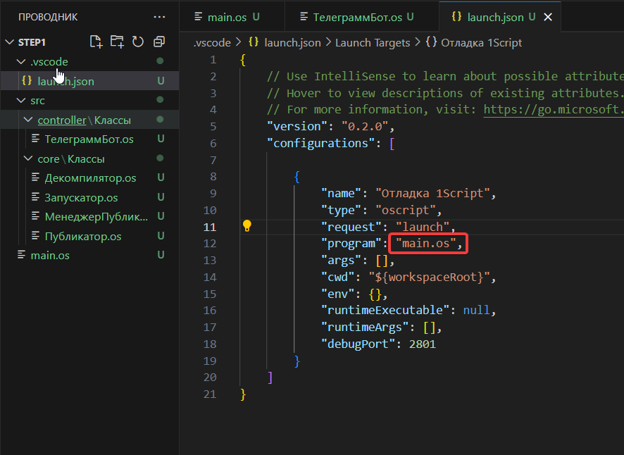

# Мастер-класс: Создание Telegram-бота для декомпиляции 1С файлов на OneScript и Осень

## Введение

Приветствую всех! Меня зовут Чегодаев Павел, и я хочу вместе с вами пройти мастер-класс по разработке бота на OneScript и фреймворка Осень.
На написание этой статьи меня вдохновила публикация [Мастер-класс по созданию приложения](https://infostart.ru/1c/articles/2275659/). Поскольку вторая часть пока не вышла, я возьму на себя смелость продолжить начинания Владимира. 

## Почему Осень?
Есть желание расширять кругозор после 15 лет работы с 1С. В Осени многие концепции заимствованы из [Java](https://infostart.ru/1c/articles/1980026/) — это стало отличным поводом изучить новые подходы, оставаясь в знакомой среде языка 1С.

Поскольку статья про мониторинг возможно когда-нибудь выйдет, я предлагаю взять другую тему.

## Техническое задание

Создать Telegram-бота, который на вход принимает бинарные файлы, а на выходе возвращает исходный код.
Приложение должно быть развертываемо в контейнере Docker.

Чтение кода должно быть реализовано максимально удобно.

## Архитектура
Любая разработка начинается с архитектуры решения. Давайте определим основную функциональность, которая должна быть реализована:

+ Обработка сообщений в боте
+ Разбор файлов на исходники
+ Публикация исходников

Попробуйте самостоятельно нарисовать диаграмму классов, а затем мы сравним результаты.

Как мы все знаем, в прошлом писался код с километровыми методами, которые выполняли множество задач одновременно. Мы не будем следовать такому подходу. Паттернов и подходов к разработке приложений много, но давайте возьмем за основу **MVC**.

Попробуем разделить наше приложение на слои, чтобы они были независимы.

**Что такое MVC:**
- **V (View)** — так как у нас Telegram-бот, то за представление пусть он и отвечает.
- **C (Controller)** — это наш мостик между представлением и бизнес-логикой.
- **M (Model)** — здесь работа с БД и бизнес-логика.

У меня получилось так:


Для удобства я буду диаграммы также оставлять в исходном виде


Давайте создадим структуру проекта. Что бы я ни делал, я всегда начинаю с команды git init, это позволит впоследствии версионировать код и, возможно, поделиться им с вами.

Любое приложение на Осени начинается с точки входа. Создадим файл main.os и другие файлы согласно нашей диаграмме.

Ожидаемая структура:


```bsl 
// main.os

#Использовать "./src/core"
#Использовать "./src/controller"
#Использовать autumn

Поделка = Новый Поделка();
Поделка.ЗапуститьПриложение();
```

Здесь мы сразу подключаем папки /src/controller и /src/core к нашему приложению, а также фреймворк Осень, который впоследствии значительно упростит разработку.

Но что произойдет в момент вызова ЗапуститьПриложение()?

Как сделать, чтобы наш бот заработал? Мы должны создать класс, у которого будет аннотация &Рогатка и метод ПриЗапускеПриложения(), давайте добавим такой класс к нашему проекту.


```bsl 
// src\core\Классы\Запускатор.os

#Область ОбъявлениеПеременных

&Пластилин("ТелеграммБот") 
Перем ТелеграммБот; // Класс для запуска Telegram-бота

#КонецОбласти

#Область ПубличныйИнтерфейс

&Рогатка
Процедура ПриСозданииОбъекта()
КонецПроцедуры

Процедура ПриЗапускеПриложения() Экспорт

	КоличествоПопытокЗапуска = 10;
	Для Счетчик = 1 По КоличествоПопытокЗапуска Цикл
		
		Попытка
			Сообщить("Старт");
			ТелеграммБот.Запустить();
		Исключение
			Сообщить(ПодробноеПредставлениеОшибки(ИнформацияОбОшибке()));
		КонецПопытки;	
	КонецЦикла;
	Сообщить("Не удалось запустить бот");

КонецПроцедуры

#КонецОбласти
```

Теперь разберем код выше. У нас есть класс, который реализует логику общения с Telegram, мы его назвали ТелеграммБот. Чтобы начать работать с этим классом, у нас есть 2 пути:

1) Создать экземпляр в коде:
```bsl
ТелеграммБот = Новый ТелеграммБот;
ТелеграммБот.Запустить()
```

2) Внедрить через механизм внедрения зависимостей Осени, причем внедрять можно 3 разными способами:

Через свойства, как в варианте выше:
```bsl
&Пластилин("ТелеграммБот") 
Перем ТелеграммБот; // Класс для запуска Telegram-бота
```

Через специальный метод сеттер:
```bsl
Перем ТелеграммБот;
&Пластилин
Процедура УстановитьТелеграммБот(Значение) Экспорт
    Пароль = Значение;
КонецПроцедуры
```
или через [конструктор](https://autumn-library.github.io/framework-elements/components-binding)

В каких случаях это может быть полезно?
Например, у нашего класса ТелеграммБот есть поле Токен и разные методы ОтправитьСообщение(), ОтправитьКартинку() и т.д.

В одном месте мы заполняем токен, потом в любых других местах через аннотацию &Пластилин мы получаем экземпляр этого класса, а он уже настроен так, как нам нужно, то есть у него уже заполнено поле токен.


## Добавляем бота

Нам нужно как-то взаимодействовать с ботом, вариантов два: или писать самому, или использовать существующие библиотеки.

Хороший программист стремится использовать готовые решения, давайте использовать готовую библиотеку. Мне нравится библиотека Антона [ОПИ](https://openintegrations.dev/), поражает подход к написанию и развитию этой библиотеки. Внимание ко всем мелочам.

```bsl
// src\controller\Классы\ТелеграммБот.os

#Использовать oint 

#Область ОбъявлениеПеременных

&Число
Перем Смещение;

Перем Токен;

#КонецОбласти

#Область ПубличныйИнтерфейс

&Желудь
Процедура ПриСозданииОбъекта()
	
КонецПроцедуры

Процедура Запустить() Экспорт

	Сообщить("Запущен");
	Токен = "7967956539";

	Пока Истина Цикл
		
		Ответ = OPI_Telegram.ПолучитьОбновления(Токен, 30, Смещение);
		Результат = Ответ["result"];
		
		Если Результат = Неопределено ИЛИ Результат.ВГраница() = -1 Тогда
			Продолжить;
		Иначе
			Сообщение = Результат[Результат.ВГраница()];
			Смещение = Сообщение["update_id"] + 1;
		КонецЕсли;

		ОбработатьСообщение(Сообщение);
	КонецЦикла;
	
КонецПроцедуры

#КонецОбласти

#Область СлужебныеПроцедурыИФункции

Процедура ОбработатьСообщение(Сообщение)

	ЧатИД = Сообщение["message"]["chat"]["id"];

	OPI_Telegram.ОтправитьТекстовоеСообщение(Токен, ЧатИД, Сообщение["message"]["text"]);	
КонецПроцедуры

#КонецОбласти
```

Теперь разберем, что тут написано?
 
Мы подключили oint (ОПИ), чтобы использовать уже готовые интеграции с Telegram.

У метода ПриСозданииОбъекта() установили аннотацию &Желудь, так мы указали, что этот класс мы можем получить в любой момент из Контейнера, создаваемого Осенью, например, как мы сделали в классе Запускатор.

Когда мы пишем &Пластилин - мы получаем экземпляр нашего объекта.

Так же внимательный читатель увидел аннотацию &Число - это тоже одна из фишек  фреймворка Осен, определтяь тип переменных.

## Предварительные итоги

На этом этапе у нас с вами готова основа, наш бот даже сейчас будет отвечать эхом. Можно запустить отладку. Для удобства пропишем в отладку запускаемый файл, тогда независимо от позиционированного в проекте файла, все равно запустится нужный.



Проверяем наш бот, работает


## Работаем с секретами

Внимательный читатель наверняка заметил, что очень нехорошо писать токен в коде, особенно когда потом проект идет в публичный репозиторий GitHub. Существуют даже роботы, которые сканируют GitHub на предмет различных секретов.
Мы могли бы создать конфигурационный файл с настройками, запрограммировать его чтение, но Осень все сделала за нас.

Нам всего-то нужно создать файлик autumn-properties.json и указать все секреты там. Не забывайте указывать его в .gitignore, иначе секреты в итоге все равно попадут в публичный доступ.

Попробуем создать конфигурационный файл:

Добавили autumn-properties.json

```json
{
    "TELEGRAMM": {
        "TOKEN": "7967956539:"
  
    }
}
```

Теперь чтобы получить доступ к нашей "Настройке" - нам нужно воспользоваться аннотацией &Деталька


## Добавляем логирование

Как и в первой части, нам пора позаботиться о логировании нашего приложения. Вместо того чтобы везде писать `Сообщить()`, давайте используем более продвинутую систему логирования.

### Создание класса ЛогАннотация

Для удобства работы с логами создадим специальный класс `ЛогАннотация.os` в папке `src/core/Классы/`:
```bsl
// main.os

#Использовать "./src/core"
#Использовать "./src/controller"
#Использовать autumn
#Использовать autumn-logos //Добавили библиотеку рабты с логами
```

```bsl
// src/core/Классы/ЛогАннотация.os

&Аннотация("ЛогПубликация")
&Лог("oscript.lib.share_bsl")
Процедура ПриСозданииОбъекта()

КонецПроцедуры
```